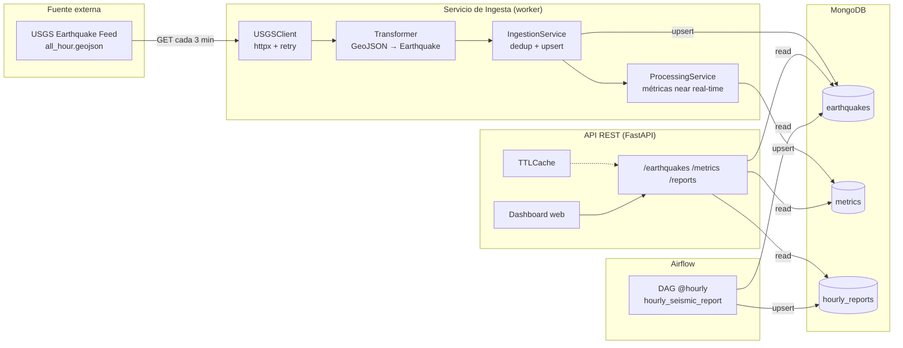

# Arquitectura de la solución

## Diagrama de componentes



## Flujo de datos

1. **Ingesta** (cada 3 min): el worker descarga el feed, transforma cada evento
   al modelo interno, descarta duplicados (comparación previa + índice único) y
   hace *upsert* en `earthquakes`.
2. **Procesamiento en tiempo real**: tras insertar eventos nuevos, se recalculan
   las métricas de las ventanas horarias afectadas y se guardan en `metrics`.
3. **API REST**: expone consultas con filtros, paginación y ordenamiento; el
   resumen global se sirve desde una caché TTL.
4. **Airflow** (cada hora): consolida los eventos de la hora en un reporte y lo
   persiste en `hourly_reports`.
5. **Dashboard**: interfaz web que consume la API y se actualiza cada 30 s.

## Decisiones de modelado de datos (MongoDB)

| Colección | Clave / índice | Justificación |
|-----------|----------------|---------------|
| `earthquakes` | `event_id` **único** | Garantiza deduplicación a nivel de BD. |
| `earthquakes` | `event_time` (desc) | Consultas por rango temporal y ordenamiento. |
| `earthquakes` | `window` (asc) | Agregaciones por hora (métricas y reportes). |
| `earthquakes` | `magnitude` (desc) | Filtros por magnitud. |
| `metrics` | `window` **único** | Una fila de métricas por ventana horaria (upsert). |
| `hourly_reports` | `window` **único** | Un reporte por hora, idempotente. |

**¿Por qué MongoDB?** El evento sísmico es un documento autocontenido y de
esquema flexible (la fuente puede añadir/omitir campos). El patrón de escritura
es *append + upsert idempotente* y las lecturas son agregaciones por ventana
temporal, algo que MongoDB resuelve eficientemente con su *aggregation pipeline*
e índices compuestos. No hay relaciones complejas que justifiquen SQL.

## Principios aplicados

- **Separación de responsabilidades**: capas `clients` / `services` / `database`
  (repositorios) / `api`, cada una con una única razón de cambio.
- **Inversión de dependencias**: los servicios reciben repositorios; las rutas
  reciben servicios ya ensamblados (DI de FastAPI).
- **SRP / SOLID**: transformación, ingesta, procesamiento y reportería están
  aisladas en clases/módulos independientes.
- **Configuración 12-factor**: todo por variables de entorno, sin credenciales
  en el código.
- **Gestión eficiente de conexiones**: cliente Motor singleton con *pool*
  reutilizado por toda la aplicación.
```
